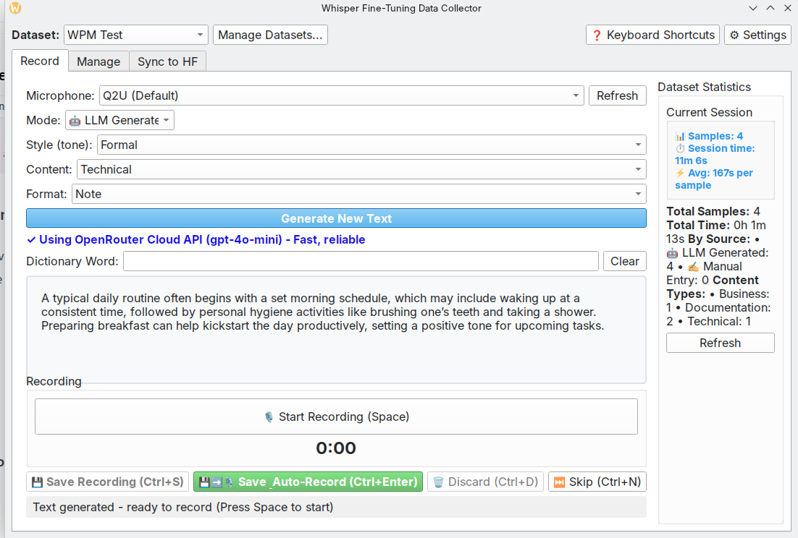
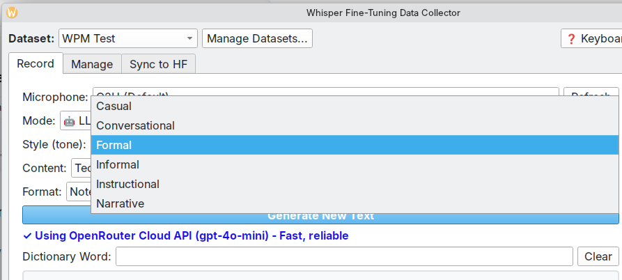
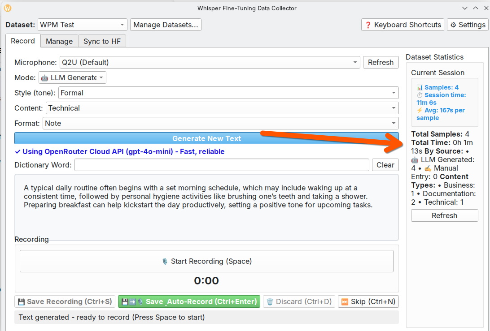
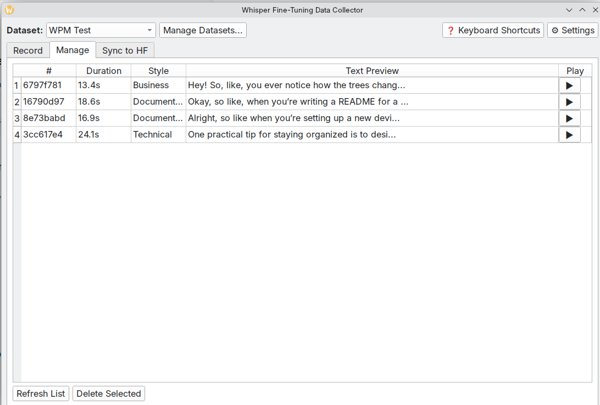
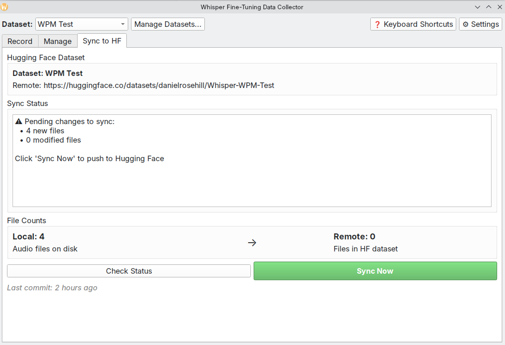
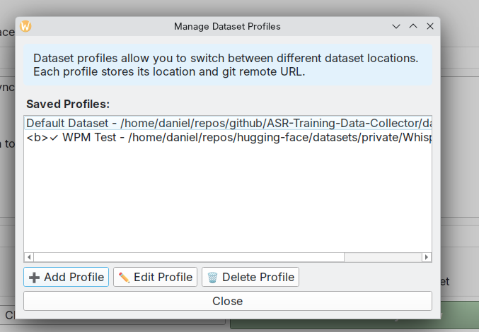
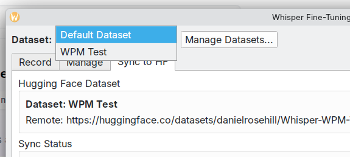
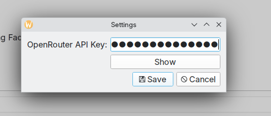

# Whisper Fine-Tuning Data Collector



## Short(ish) Version

(Author: me)

This is a GUI that I created with Claude Code to facilitate gathering audio training data for an ASR fine-tuning project. 

The UI is reflective of my objective (ie, training Whisper) but can be adapted for training needs. 

This GUI is built to help with a common task in data prep for audio but which I couldn't find a GUI for (I'm sure one exists, I just didn't land on it!).

Namely, it provides a way to:

- Generate source truth text according to specific parameters (to support fine-tuning for domain-specific vocab, there's an option to create your own text and another to ask the LLM to use specific words). 
- Record the matching audio 
- Preserve the mapping in JSONL  

Gathering training data like this is only mildly mind-numbing. So to give the user some motivation that this will be worth it, there's a little database stats window that computes the total gathered training time on the right. 

There are many approaches to training ASR models that are significantly more advanced like this. This GUI was created for those instances in which you don't need a huge volume of training data, but you do want to get it captured. 

Some other bells and whistles:

- I added a short clip/cut-off logic for saving the audio files. The objective was to avoid capturing the sound of key presses when starting and stopping capture.  

Shortcomings:

- Getting the LLM to generate sentences that adhere to the input params (including custom vocab when requested) AND which make sense is ..... hard. Some tuning of prompts is advised when trying to get this right. 

Useful features:

- I created this GUI for one project then needed it for another. I realised that creating these afresh every time (even vibe coded) was not smart. That's why this GUI supports dataset configs so you can use it for different projects. Remotes are autodetected based on the prescence of a `.git` folder which works for both Hugging Face and Github remotes.

The rest of the readme is by ... Claude!

## Screenshots












## Features

- **LLM-powered text generation** - Uses OpenRouter API with GPT-4o-mini for text generation
  - 100-150 word samples (optimal for speech training)
  - Multiple text styles (technical, informal, voice notes, narrative, etc.)
  - Customizable content types and formats
- **Audio recording** - Record directly from your microphone
- **Duration constraints** - Enforces 1-35 second clips (optimal for Whisper training)
- **Statistics tracking** - Real-time display of total recording time and sample counts
- **Hugging Face sync** - Direct push to HF dataset repository
- **Multi-dataset support** - Manage and switch between multiple datasets
- **Standard dataset format** - Compatible with Hugging Face `audiofolder` format

## Setup

### Application Setup

1. Create a virtual environment:
```bash
uv venv
source .venv/bin/activate
```

2. Install dependencies:
```bash
pip install -r requirements.txt
```

### API Keys & Configuration

The application requires **two API tokens** for full functionality:

#### 1. OpenRouter API Key (for LLM text generation)
- **Purpose:** Generates text prompts for you to read and record
- **Get your key:** Sign up at [openrouter.ai](https://openrouter.ai)
- **Configuration:** Set via Settings dialog in the app, or add to `.env` file:
  ```bash
  OPENROUTER_API_KEY=your_key_here
  ```

#### 2. Hugging Face Token (for dataset sync)
- **Purpose:** Push recorded audio samples to your Hugging Face dataset repository
- **Get your token:** [huggingface.co/settings/tokens](https://huggingface.co/settings/tokens) (create a **write** token)
- **Configuration:** Automatically used by git when pushing to HF (configure with `git config` or use HF CLI)
  ```bash
  # Option 1: Use HF CLI to login
  huggingface-cli login

  # Option 2: Configure git credential helper
  git config --global credential.helper store
  # Then push once and enter your HF token as password
  ```

## Usage

### Recording Data

Run the application:
```bash
./run.sh
# or
python app/main.py
```

The GUI will open in your browser at http://127.0.0.1:7860

1. Select a text style from the dropdown
2. Click "Generate New Prompt" to get text to read
3. Click the microphone to record yourself reading the text
4. Click "Save Recording" to save, or "Skip" for a new prompt

### Exporting Dataset

Export your collected data to Hugging Face-compatible JSONL format:
```bash
python app/export_dataset.py
```

This creates an `exported_dataset/` directory with:
- `whisper_train.jsonl` - Training split (70% of samples)
- `whisper_validation.jsonl` - Validation split (15% of samples)
- `whisper_test.jsonl` - Test split (15% of samples)
- `audio/` - WAV audio files
- `README.md` - Dataset documentation with proper YAML front matter

**Important:** The JSONL format with train/validation/test splits is **required** for proper display on Hugging Face. See [huggingface-audio-dataset-format.md](huggingface-audio-dataset-format.md) for detailed format documentation.

### Loading the Dataset

```python
from datasets import load_dataset

# Load from local directory
dataset = load_dataset("json", data_files={
    "train": "exported_dataset/whisper_train.jsonl",
    "validation": "exported_dataset/whisper_validation.jsonl",
    "test": "exported_dataset/whisper_test.jsonl"
})

# Or load from Hugging Face after upload
dataset = load_dataset("your-username/your-dataset-name")
```

## Data Structure

```
data/
├── audio/          # WAV recordings
├── text/           # Text transcriptions
├── metadata/       # Individual sample JSON files
└── manifest.json   # Master index of all samples
```

## Dataset Configuration & Management

### Multiple Dataset Support

The application supports working with multiple datasets through **Dataset Profiles**. Each profile stores:
- Dataset location (local directory path)
- Git remote URL (Hugging Face dataset repository)
- Custom audio categories and text styles

**Managing Dataset Profiles:**
1. Open the application
2. Use the dataset dropdown in the top toolbar to switch between profiles
3. Click "Manage Datasets" to add, edit, or delete profiles
4. Each profile can point to a different Hugging Face dataset repository

### Dataset Storage Locations

**Default locations:**
- **Development mode:** `./data` (in project directory)
- **Installed package:** `~/.local/share/whisper-finetuning-data`
- **Custom location:** Set via `WHISPER_FT_DATA_DIR` environment variable

**Example custom location:**
```bash
export WHISPER_FT_DATA_DIR="/path/to/your/dataset"
python app/desktop.py
```

### Manual Sync to Hugging Face

If you need to sync your dataset outside the GUI, use the CLI helper:

```bash
./sync_to_hf.sh
# or specify a dataset directory
WHISPER_FT_DATA_DIR=/path/to/your/dataset ./sync_to_hf.sh
```

The script:
- Prints pending `git status`
- Counts local/remote audio files
- Stages, commits, and pushes changes to Hugging Face
- Provides a reliable backup sync path outside the GUI

### Setting Up a New Dataset

1. **Clone your Hugging Face dataset:**
   ```bash
   git clone https://huggingface.co/datasets/your-username/your-dataset-name /path/to/dataset
   ```

2. **Add it as a profile in the app:**
   - Click "Manage Datasets"
   - Click "Add Profile"
   - Enter a name and browse to the dataset path
   - The app will auto-detect the git remote URL

3. **Start collecting data:**
   - Select the profile from the dropdown
   - Generate prompts and record audio
   - Sync to Hugging Face from the "Sync" tab

## Text Styles

- **technical** - Software/programming explanations
- **informal** - Casual conversation
- **voice_note** - Quick reminders and memos
- **narrative** - Story excerpts
- **instructional** - Step-by-step instructions
- **conversational** - Phone conversation style
- **professional** - Business communication
- **mixed** - Varied tones

## Requirements

- Python 3.8+
- OpenRouter API key (for text generation)
- Microphone access
